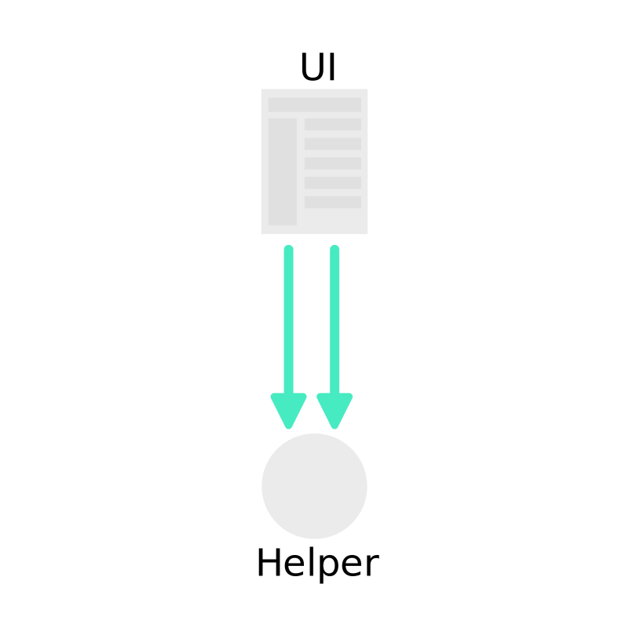
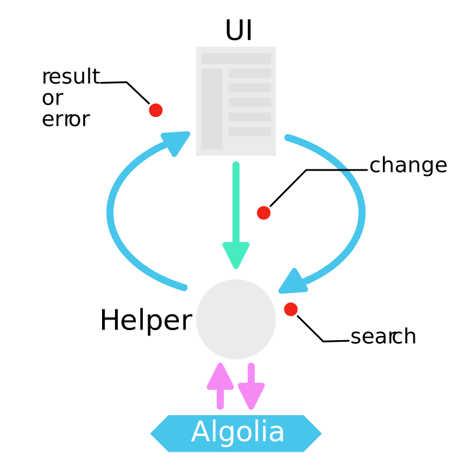

## High level concepts

### Search flow

The search flow is the cycle between the UI and the search engine.
When a user updates a parameter in the UI, a new search is triggered,
and new results appear. But not only these results are updated, but
also all the filters available should be too.


### The UI source of truth

The Helper stores and keeps track of the successive filters applied in
your search UI. It is the source of truth for your search parameters. This
makes all the UI components that you use independent from each other while
still being able to trigger the search. For example, the text search input
will only set the `query` whereas the category list will only deal with
facets. But both will trigger the search with the parameters of the other.


Changing the parameters of the search with the Helper does not trigger the 
search. Instead the changes are stored until the `search` method is called.
Taking the first schema for reference, the updates look like that:



## Advanced facetting

Algolia is by itself very flexible and fast. That speed let us implement
advanced search features using a combination of requests with a merging
strategy. Those advanced advanced features are directly available in the
helper.

### Disjunctive facetting

With Algolia you can retrieve for each facetted attribute the most used
values in your results. This means that if a value is not in your
results, you won't be aware of its existence. This can be inconvenient when
you want your user to be able to select many values and combine them with an OR
condition, because once you've selected a value the other that could
be chosen won't be returned by Algolia.

Let's take an example. Imagine your dataset contains high-tech products.
And those products are categorized. Amongst those products you have TVs
and video projectors, each in their own category. By default, if you select
TV then only the TV will be returned and therefore the facet values for the
category will only be TV.


The purpose of the disjunctive facets is to be able to search further than
a single facet filter. To do that, the helper implements a second request that
will be specifically tailored to retrieve the other facet values possible for
a specific facetted attribute.

Going back to our example, the first request retrieves the results and a second
one will retrieve the values for the category attribute. When the results come
back from Algolia the two requests will be merged and a single list of values
will be created.


### Hierarchical facetting

The hierarchical facets extends the concepts used in the disjunctive facetting
in order to be able to organize the values in a tree like fashion.

When using the same high-tech e-shop example (see the previous paragraph about
[disjunctive facetting](#disjunctive-facetting)), we can imagine that TV and video
projectors are organized in a higher category called video hardware.

The structure inside the record should contain all the variations per level. For a
product in the TV category, the record will have a `lvl1` attribute that will contain
`video hardware` and a `lvl2` that will contain `video hardware > TV`. With the
hierarchicalf feature, you can facet values per level and you will be provided the correct
hierarchy of facet values.

## Special capabilities

What makes the special sauce of the Helper is a conjunction of patterns and
smart tricks to help you make the best search UI.

### Event based

In UIs, it's very likely that you will have more than a single point where you
want to update and trigger a new search. On the other hand, it's very unlikely
that where you want to update the UI will be at the same place.

For those reasons, the Helper implements events. There are four kinds of events
on the Helper : 

 - `change`: triggered when a parameter is set or updated
 - `search`: triggered when the search is sent to Algolia
 - `result`: triggered when the results are retrieved Algolia
 - `error`:  triggered when Algolia sends back an error



### Chainability

All the write operations of the Helper are chainable. This means that
all those methods will return the Helper object. This leads to a more
concise way to express the operations done on the helper.

For example, setting the query and triggering the search looks like that,
thanks to the chainability:

```js
helper.setQuery('tv')
      .search();
```

### Smart page behaviour

In a search engine, the most relevant results are always on the first page.
And each new set of parameters sent to Algolia will return a new set of
results. This means that each time the parameters are changed, the most relevant
will be on the very first page. Also, each new set of parameters might change
the number of available pages. Therefore, when the parameters are changed the
page should be set to 0. This would lead to writing such code for each kind of
settings to be set:

```js
// When we set the query
helper.setQuery(query)
      .setPage(0)
      .search();

// When we change a tag filter
helper.toggleTag(tag)
      .setPage(0)
      .search();
```

To avoid this kind of repetition, all the write methods will set the page to 0 with
the exception of `setPage`.

### Immutability of the search parameters

An immutable object is an object which values cannot be modified after it is
created. For example, in Javascript strings are immutable. This means that
you can't direclty change the value and each write operation will return a new
object.

Inside the Helper, we use an immutable object to store the search parameters. The
Helper write and read methods are proxies to the search parameters object.

For example, when the setQuery method is called it is forwarded to the search
parameters. This will create a new instance of the search parameters, which
will replace the `state` property of the helper, and finally the helper will
emit the `change` event.

The immutability of the search parameters has some interesting usage:

 - each search parameters is stored when the request is sent to Algolia, and
provided back when the `result` event is fired.
 - if we want to create urls with different parameters, we can reuse the search
parameters object and its api to create new states that we can serialize.


